# 📁 Project Folder & File Structure Guide

This document outlines the complete file, folder, and system workflow architecture for the Naxxivo Web Utilities platform.

---

## 🔄 System Architecture & Workflow Diagram

```mermaid
graph TD
    A[User Browser] -->|Requests Route| B(src/main.tsx)
    B --> C(src/App.tsx - Wouter Router)
    C --> D[src/components/layout/AppLayout.tsx]
    
    D --> E[Navigation Sidebar & Categorized Menu]
    D --> F[Page Router Container]
    D --> G[Footer & Sound Settings]

    F -->|/| H[pages/Home.tsx - Creator Studio Hub]
    F -->|/smart-bot| SB[pages/SmartBot.tsx - All-in-One Smart AI Assistant]
    F -->|/image-compressor| IC[pages/ImageCompressor.tsx - 10MB Quality Compressor]
    F -->|/image-converter| ICONV[pages/ImageConverter.tsx - 5 Formats WebP/PNG/JPG/AVIF/BMP]
    F -->|/menu| MENU[pages/MenuDirectory.tsx - Categorized Tools Directory]
    F -->|/title-generator| TG[pages/TitleGenerator.tsx]
    F -->|/description-generator| DG[pages/DescriptionGenerator.tsx]
    F -->|/channel-analyzer| CH[pages/ChannelAnalyzer.tsx]
    F -->|/video-analyzer| VA[pages/VideoAnalyzer.tsx]
    F -->|/thumbnail-downloader| TD[pages/YouTubeDownloader.tsx]
    F -->|/text-tools| J[pages/TextTools.tsx]
    F -->|/favicon-generator| K[pages/FaviconGenerator.tsx]
    F -->|/prompts| P[pages/PromptsHome.tsx]
    F -->|/prompts/:id| PD[pages/PromptDetail.tsx]
    F -->|/history| HIST[pages/History.tsx]
    F -->|/about-us| ABT[pages/AboutUs.tsx]
    F -->|/contact-us| CNT[pages/ContactUs.tsx]
    F -->|/privacy-policy| PP[pages/PrivacyPolicy.tsx]
    F -->|404 Route| L[pages/not-found.tsx]

    SB -->|Auto-detects YouTube URLs| YT[src/api/youtubeApi.ts]
    SB -->|In-Chat Image Processing| CANVAS[Browser Canvas - WebP/PNG/JPG/Compress]
    SB -->|Gemini 3.7 Chat & Intelligence| AI[src/api/aiService.ts]
    CH & VA & TG & DG --> YT
    CH & VA & TG & DG --> AI
    AI -->|1. Try Express Endpoint| SRV[server.ts - Express Endpoints /api/ai/chat, /api/ai/optimize]
    AI -->|2. Direct Browser Fallback| GEMINI[Gemini AI Engine - Direct Client API Call]
    YT --> KEY[src/api/apiKeys.ts - YouTube Permanent API Key]

    CH --> M1[Channel Banner, Handle, ID, Stats, Account Age, Keywords]
    CH --> M2[Gemini AI Channel Optimizer - SEO Name, Description, Tags]
    VA --> V1[Video Thumbnail + 1080p HD Download, Metrics, SEO Keywords]
    VA --> V2[Gemini AI Video Optimizer - High CTR Titles, SEO Description, Hashtags]
```



### 🔁 Data & Execution Flow Summary
1. **Entry Point**: `src/main.tsx` initializes the application and renders `src/App.tsx`.
2. **Layout Shell**: `AppLayout.tsx` provides categorized navigation (Image Tools, YouTube Tools, AI & Prompts, Text & Utilities), collapsible sidebar groups, theme toggle, and audio controllers.
3. **Smart AI Assistant**: `src/pages/SmartBot.tsx` operates with pure client-side intelligence and zero API key requirement for local image operations (compression, format conversion, and tag extraction).
4. **YouTube API Integration**: `src/api/youtubeApi.ts` fetches real-time channel statistics and video metadata.
5. **AI Optimizer & Token Saver**: `src/components/AiOptimizerCard.tsx` uses token caching, prompt compression, and server-side optimization to save API tokens.

---

## 📂 Root Directory Structure

```text
/
├── AGENTS.md                 # Agent instructions and automatic documentation rules
├── FOLDER_STRUCTURE.md       # Comprehensive folder structure and workflow guide
├── vercel.json               # Vercel deployment SPA rewrite configuration
├── index.html                # Main HTML entry point with Google AdSense and meta tags
├── server.ts                 # Express Backend Server with Gemini AI endpoints
├── api/                      # Vercel Serverless Function directory
│   └── index.ts              # Express Serverless Handler for Vercel (/api/*)
├── public/                   # Static assets and media files
│   ├── sw.js                 # Service Worker for push notification handling
│   ├── sitemap.xml           # Search Engine Sitemap Index
│   ├── robots.txt            # Search Engine Crawler rules
│   ├── _redirects            # Netlify/Static Host SPA rewrite rules
│   └── sounds/               # Audio sound effects library (.wav files)
├── metadata.json             # App metadata and title configuration
├── package.json              # Project dependencies and script definitions
├── vite.config.ts            # Vite build and development configuration
├── src/                      # Source code root
│   ├── main.tsx              # Application entry point
│   ├── App.tsx               # Main Router and page layout routes
│   ├── index.css             # Global CSS and Tailwind directives
│   │
│   ├── api/                  # API clients and key configurations
│   │   ├── apiKeys.ts        # YouTube and Gemini API key constants
│   │   ├── aiService.ts      # Gemini AI client handler
│   │   └── youtubeApi.ts     # YouTube Data API v3 helper functions
│   │
│   ├── pages/                # Application page views
│   │   ├── Home.tsx              # Main Creator Studio Hub with categorized tool search
│   │   ├── SmartBot.tsx          # Full-screen Smart AI Bot & Automation chat
│   │   ├── ImageCompressor.tsx   # Image Compressor (10MB max, Quality slider 10-100)
│   │   ├── ImageConverter.tsx    # Format Converter (JPEG, PNG, WebP, AVIF, BMP)
│   │   ├── MenuDirectory.tsx     # Categorized Tools Directory (/menu, /tools)
│   │   ├── ChannelAnalyzer.tsx   # YouTube Channel Analyzer & AI Audit
│   │   ├── VideoAnalyzer.tsx     # YouTube Video & SEO Tag Inspector
│   │   ├── YouTubeDownloader.tsx # YouTube HD Thumbnail Downloader
│   │   ├── TitleGenerator.tsx    # AI YouTube Title Generator (High CTR, Viral Hooks)
│   │   ├── DescriptionGenerator.tsx # AI Video Description Generator (Timestamps, SEO)
│   │   ├── TextTools.tsx         # Text manipulation and format exporter
│   │   ├── FaviconGenerator.tsx  # Multi-resolution Favicon Generator (.ico)
│   │   ├── PromptsHome.tsx       # AI Image Prompts Hub
│   │   ├── PromptDetail.tsx      # Prompt Detail and 1-Click Copy View
│   │   ├── Auth.tsx              # Supabase Authentication View
│   │   ├── Profile.tsx           # User Profile View
│   │   ├── History.tsx           # Action and Download History Tracker
│   │   ├── AboutUs.tsx           # About Us information page
│   │   ├── ContactUs.tsx         # Contact Us feedback form
│   │   ├── PrivacyPolicy.tsx     # Privacy policy and GDPR compliance
│   │   └── not-found.tsx         # 404 error page
│   │
│   ├── components/           # Reusable UI components
│   │   ├── SoundEffectsController.tsx # Global audio toggle and volume modal
│   │   ├── NotificationBanner.tsx # Push notification permission banner
│   │   ├── AiOptimizerCard.tsx # Gemini AI optimization card
│   │   ├── WorkflowScanner.tsx # YouTube inspection progress animation
│   │   ├── layout/
│   │   │   └── AppLayout.tsx # Navigation layout shell with categorized menus
│   │   ├── seo/
│   │   │   ├── BookmarkBanner.tsx # Bookmark helper banner
│   │   │   ├── FaqSection.tsx     # Reusable FAQ accordion
│   │   │   ├── SeoContentImage.tsx # Image tools SEO content
│   │   │   ├── SeoContentText.tsx  # Text tools SEO content
│   │   │   └── SeoContentYouTube.tsx # YouTube tools SEO content
│   │   ├── ui/               # Base UI primitives (buttons, inputs, cards)
│   │   └── theme-provider.tsx # Dark/Light theme provider
│   │
│   ├── hooks/                # Custom React hooks (useHistory, useToast)
│   └── lib/                  # Helper utilities
│       ├── botLogic.ts       # SmartBot NLP engine and rule matching
│       ├── botCommandMatcher.ts # SmartBot command exporter
│       ├── sound.ts          # Web Audio & sound effect manager
│       ├── supabase.ts       # Supabase client configuration
│       ├── notifications.ts  # Push notification triggers
│       └── utils.ts          # Tailwind cn utility function
```

---

## 💡 File & Component Purpose Guide

| File / Directory | Purpose & Functionality |
| :--- | :--- |
| **`server.ts`** | Express backend server handling `/api/ai/chat` and `/api/ai/optimize` with built-in token saver caching. |
| **`src/pages/Home.tsx`** | Creator Studio homepage showcasing all 11+ creator tools with search and categorization. |
| **`src/pages/SmartBot.tsx`** | Fullscreen Smart Bot chat UI featuring drag-and-drop file processing, instant conversions, and Gemini AI. |
| **`src/pages/ImageCompressor.tsx`** | Dedicated image compressor with 10–100 quality slider, canvas scaling, live size metrics, and 10MB limit. |
| **`src/pages/ImageConverter.tsx`** | Format converter supporting JPEG, PNG, WebP, AVIF, and BMP with canvas rendering and audio cues. |
| **`src/pages/MenuDirectory.tsx`** | Complete categorized directory view for Image Tools, YouTube Tools, AI Hub, and Text Utilities. |
| **`src/components/layout/AppLayout.tsx`** | Responsive app shell containing categorized collapsible navigation menus and global controls. |
| **`src/lib/botLogic.ts`** | Client-side intent parser for matching commands to YouTube or image processing actions in English. |
| **`src/lib/sound.ts`** | Sound manager with Web Audio API synthesis fallback and local storage persistence. |

---

## 📌 Automatic Documentation Protocol
> **Rule:** Whenever files or folders are modified or added, this `FOLDER_STRUCTURE.md` is updated to keep documentation synchronized.
